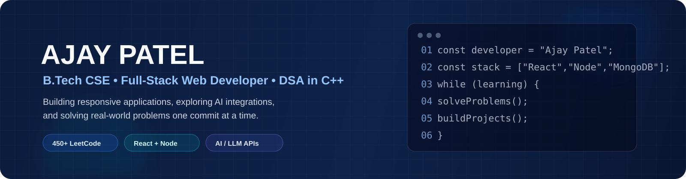

 

  

---

## 👋 About Me

Hi, I'm **Ajay Patel**, a **B.Tech Computer Science Engineering student at Parul University** and a **Full-Stack Web Developer**.

I enjoy building responsive, practical web applications, working with modern JavaScript technologies, integrating AI/LLM capabilities, and strengthening my problem-solving skills through Data Structures & Algorithms.

- 🎓 **B.Tech CSE** — Parul University, Vadodara
- 📈 **CGPA:** 8.48 / 10.0
- 💻 **450+ LeetCode problems** solved across Arrays, Graphs, Dynamic Programming, Trees, and Greedy
- 🤖 Interested in **AI/ML, LLM API integration, and Prompt Engineering**
- 🚀 Building and deploying projects with **React, Node.js, Express.js, MongoDB, and Vercel**
- 📚 Currently strengthening **DSA in C++**
- 📍 Vadodara, Gujarat, India
- 📫 **Email:** [ajaypatel1994mzp@gmail.com](mailto:ajaypatel1994mzp@gmail.com)

---

## 🛠️ Tech Stack

### Languages

  

### Frontend

  

**Also:** GSAP • Responsive Web Design

### Backend & APIs

  

**Also:** RESTful APIs • JWT Authentication • Middleware • Mongoose ODM

### Databases

  

### Tools & Platforms

  

### AI / Computer Science
**LLM API Integration • Prompt Engineering • Generative AI Tools • Time & Space Complexity • SDLC • Agile Methodology • System Design Basics**

---

## 💼 Experience

### Software Developer Intern — Hindalco Industries Ltd. (Aditya Birla Group)
**May 2025 – June 2025 | Renukoot, Uttar Pradesh**

- Developed front-end features for an internal travel management web application using **HTML, CSS, and JavaScript**.
- Improved UI consistency across **5+ key pages**.
- Collaborated with a full-stack team using an **Agile/Scrum** workflow and participated in daily stand-ups.
- Delivered assigned work on schedule within a **30-day sprint cycle**.
- Gained hands-on experience with production codebase management, code reviews, and **Git-based version control**.
- Received formal recognition for performance from the Aditya Birla Group Learning & Development team.

---

## 🚀 Featured Projects

### 🛒 E-Commerce Web Application
**React.js • HTML5 • CSS3 • JavaScript • REST API • Vercel**

- Built a fully responsive storefront with **20+ products**, dynamic filtering, cart functionality, and product detail pages.
- Created **15+ reusable React components**, reducing code duplication by approximately **40%**.
- Integrated a mock REST API with dynamic product rendering, loading states, and error boundaries.
- Achieved a **90+ Lighthouse performance score**.
- Deployed on Vercel with a CI/CD workflow.

🔗 **Live Demo:** [patelstore-bice.vercel.app](https://patelstore-bice.vercel.app/)

---

### 🤖 Smart Personal Finance & Investment Advisor
**React.js • Node.js • Express.js • MongoDB • AI/ML**

- Engineering a full-stack AI-powered platform for **authentication, expense tracking, goal management, and report generation**.
- Built a RESTful backend with **10+ API endpoints** using Node.js and Express.js.
- Developed an interactive dashboard with **5 chart types**: bar, line, pie, donut, and area.
- Integrated an **LLM-based AI chatbot** for natural-language questions and insights.
- Designed MongoDB schemas around **users, transactions, goals, and insights** collections.
- Used aggregation pipelines for data-driven reporting and insights.

---

## 🧠 DSA & Problem Solving

I regularly practice competitive programming and interview-style problems in **C++**.

**450+ LeetCode problems solved** covering:

`Arrays` • `Strings` • `Linked Lists` • `Stacks & Queues` • `Trees` • `Graphs` • `Greedy` • `Dynamic Programming` • `Hashing` • `Sliding Window` • `Binary Search`

🔗 **LeetCode:** [leetcode.com/u/ajay_patel1994](https://leetcode.com/u/ajay_patel1994/)

---

## 🏆 Achievements & Activities

- ✅ Solved **450+ DSA problems on LeetCode**.
- 🏗️ Participated in **university-level hackathons and coding competitions**.
- 📜 Completed industry-recognized certifications in **Advanced JavaScript** and **React.js Development**.
- 🔥 Maintains public GitHub repositories with a consistent commit history and version-control practices.
- 💼 Completed a Software Developer Internship at **Hindalco Industries Ltd. (Aditya Birla Group)**.

---

## 📊 GitHub Statistics

  

---

## 🌐 Connect With Me

---

### 💡 Build. Solve. Learn. Repeat.

*"Turning ideas into applications and problems into solutions."*

